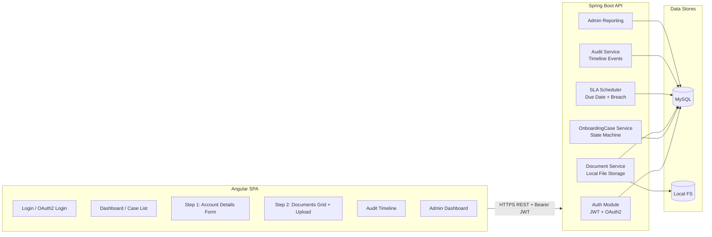
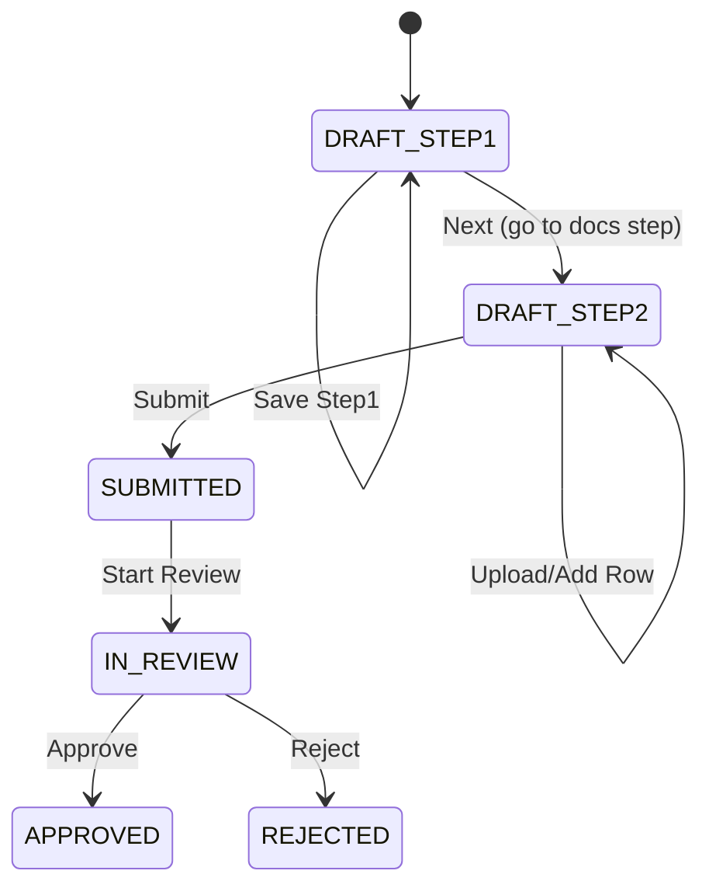
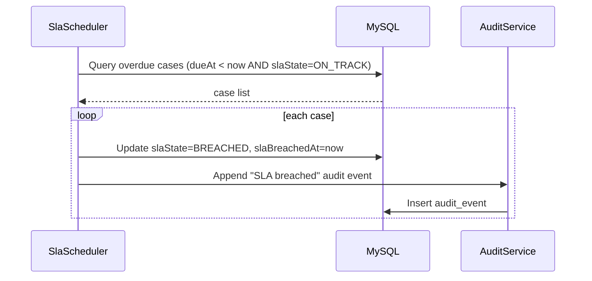
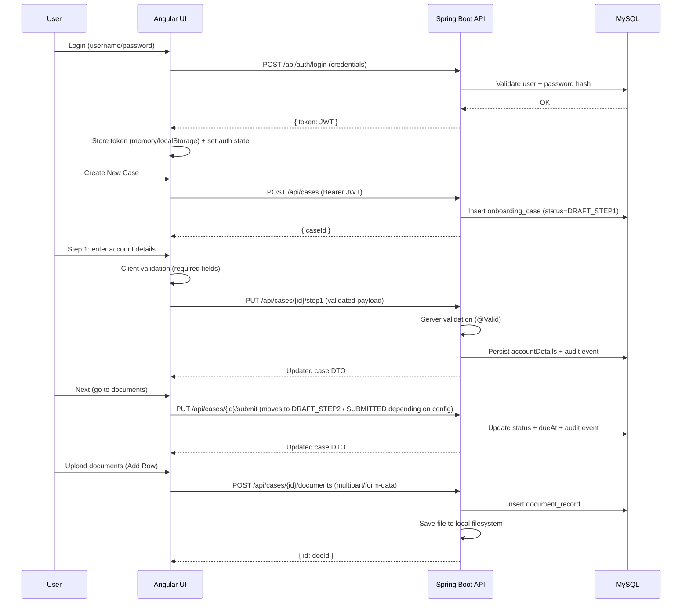
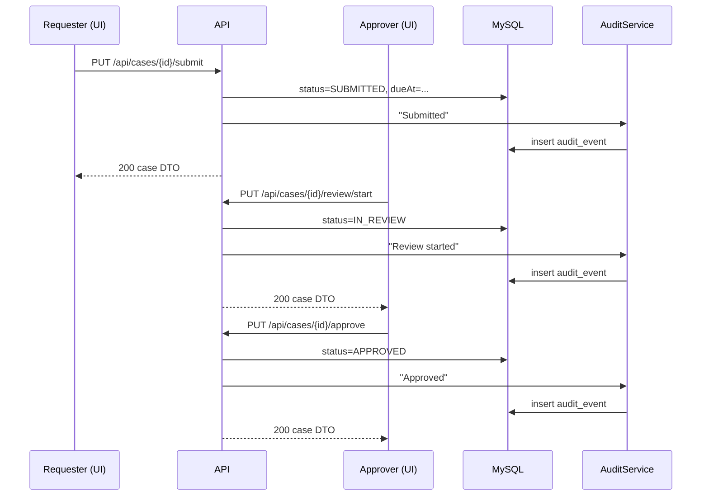

# KYC Onboarding (Appian → Spring Boot + Angular) — No BPM Engine

This project recreates the Appian onboarding **process model** using **plain Spring Boot services** (state machine + SLA timers)
and an **Angular UI** for Step-1 (Account Details) + Step-2 (Case Documents).

- **DB:** MySQL  
- **File storage:** Local filesystem  
- **Security:** JWT (username/password) **and** OAuth2 login (issues JWT on success)

---

## 1) Architecture Overview



---

## 2) Component Diagram

```mermaid
flowchart TB
  C[Angular Components] -->|HTTP| G[API Gateway (Spring Boot)]
  G --> AC[AuthController]
  G --> OC[OnboardingCaseController]
  G --> DC[DocumentController]
  G --> AD[AdminController]

  AC --> AS[AuthService]
  OC --> CS[OnboardingCaseService]
  DC --> DS[DocumentService]
  DS --> FS[FileStorageService]
  AD --> RS[ReportingService]

  CS --> AR[(OnboardingCaseRepository)]
  DS --> DR[(DocumentRecordRepository)]
  RS --> AR
  RS --> DR

  CS --> AUD[AuditService]
  DS --> AUD
  AUD --> AUR[(AuditEventRepository)]

  SLA[SlaScheduler] --> CS
```

---

## 3) Process Flow (Appian Process Model → Spring Services)

### Statuses (state machine)
- `DRAFT_STEP1` → (save Step 1) stays `DRAFT_STEP1`
- `DRAFT_STEP1` → (Next/Submit Step 1) → `DRAFT_STEP2`
- `DRAFT_STEP2` → (Upload docs / add rows) stays `DRAFT_STEP2`
- `DRAFT_STEP2` → (Submit Case) → `SUBMITTED`
- `SUBMITTED` → (Start Review) → `IN_REVIEW`
- `IN_REVIEW` → (Approve) → `APPROVED`
- `IN_REVIEW` → (Reject) → `REJECTED`



---

## 4) SLA / Due Date Logic (Appian Timers Equivalent)

**Rule:** every case has `dueAt` and `slaState`:
- `ON_TRACK` (default)
- `BREACHED` if `now > dueAt` and case not in terminal state

Scheduler runs periodically:
1. finds cases where `dueAt < now` and `slaState=ON_TRACK`
2. marks them `BREACHED`
3. writes an `AUDIT` event (“SLA breached”)



---

## 5) UI Layer Flow (Authentication + Validations + Step Screens)



### Validations
- **Angular (client-side):** required fields, simple formats, disabling buttons until valid
- **Spring Boot (server-side):** `@Valid` DTO validation + role-based guards per endpoint

---

## 6) API Endpoints

### Auth
- `POST /api/auth/register`
- `POST /api/auth/login`

### Cases
- `POST /api/cases` (create)
- `GET /api/cases` (list my cases / authorized)
- `GET /api/cases/{caseId}`
- `PUT /api/cases/{caseId}/step1` (save Step 1)
- `PUT /api/cases/{caseId}/submit` (submit / move forward)
- `PUT /api/cases/{caseId}/review/start`
- `PUT /api/cases/{caseId}/approve`
- `PUT /api/cases/{caseId}/reject`
- `GET /api/cases/{caseId}/audit` (audit timeline)

### Documents
- `POST /api/cases/{caseId}/documents` (multipart upload: `file`, `type`, `label`)
- `GET /api/cases/{caseId}/documents`
- `GET /api/documents/{docId}/download`
- `DELETE /api/documents/{docId}`

### Admin
- `GET /api/admin/stats`

---

## 7) Sequence Diagram — Approval Path



---

## 8) Local Run

### Backend
1. Configure MySQL + update `backend/src/main/resources/application.yml`
2. Run:
   - `mvn -q -f backend/pom.xml spring-boot:run`

### Frontend
- `cd frontend`
- `npm install`
- `npm start`

---

## 9) Postman
Import the included Postman collection:
- `postman/KYC-Onboarding.postman_collection.json`

Set variables:
- `baseUrl` (e.g., `http://localhost:8080`)
- `token` (auto-set after login)

---

## 10) OAuth2 Notes
OAuth2 requires browser-based redirects:
- `/oauth2/authorization/{provider}` (configured in Spring Security)
- On success, backend redirects to `app.oauth2.redirectUrl?token=<JWT>`
