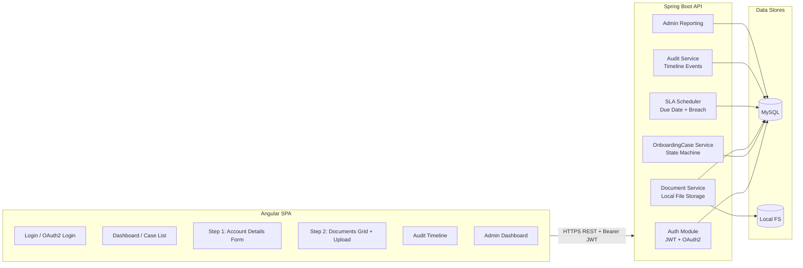
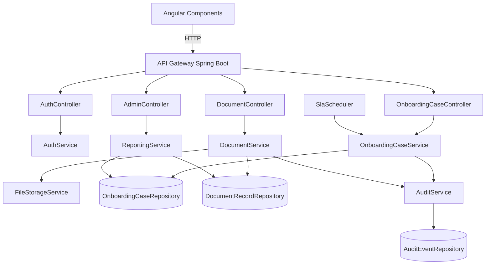
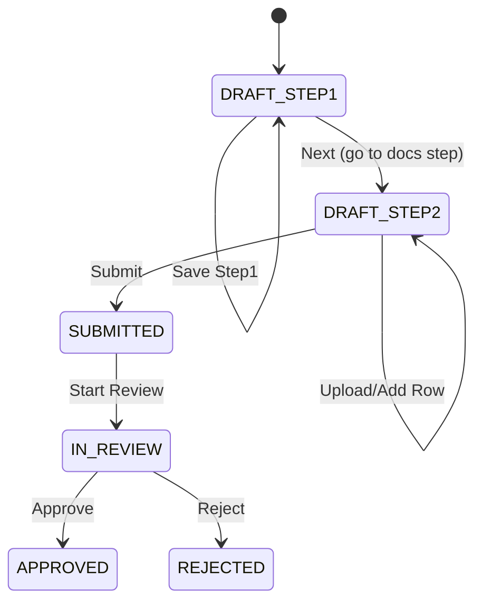
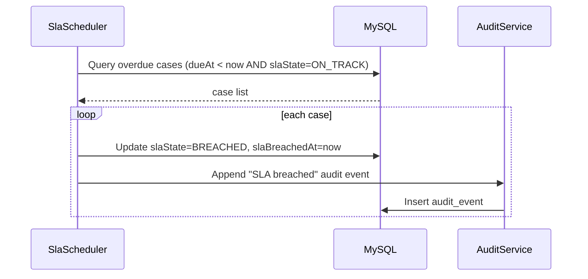
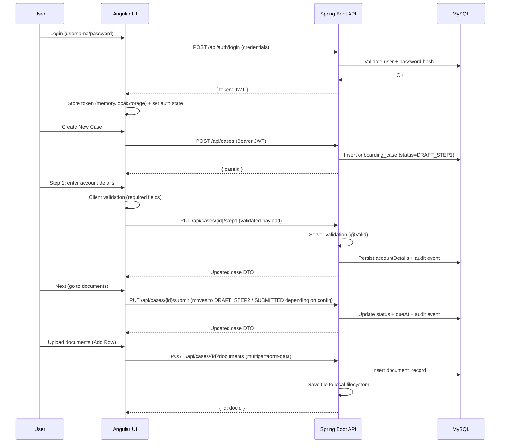
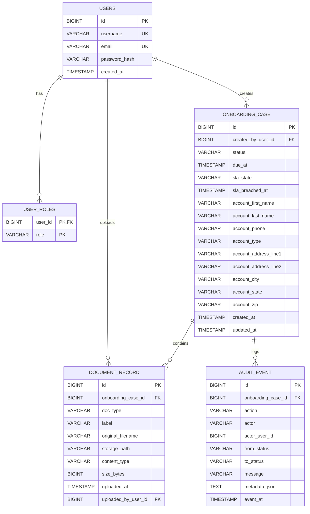
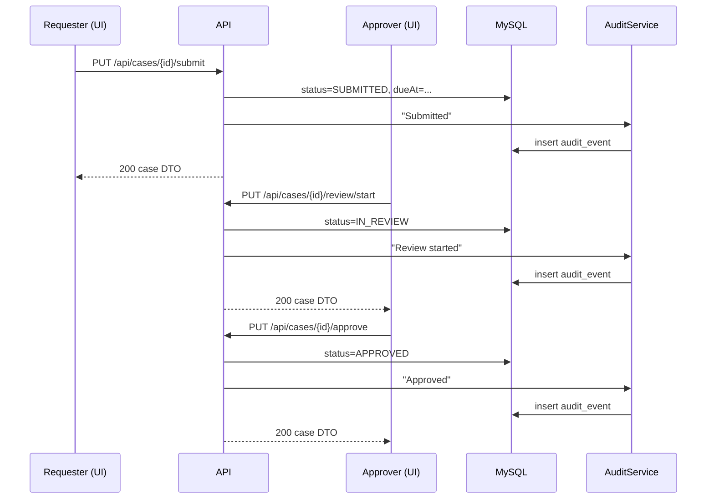

# KYC Onboarding (Appian → Spring Boot + Angular) — No BPM Engine

This project recreates the Appian onboarding **process model** using **plain Spring Boot services** (state machine + SLA timers)
and an **Angular UI** for Step-1 (Account Details) + Step-2 (Case Documents).

- **DB:** MySQL  
- **File storage:** Local filesystem  
- **Security:** JWT (username/password) **and** OAuth2 login (issues JWT on success)

---

## 1) Architecture Overview



---

## 2) Component Diagram



---

## 3) Process Flow (Appian Process Model → Spring Services)

### Statuses (state machine)
- `DRAFT_STEP1` → (save Step 1) stays `DRAFT_STEP1`
- `DRAFT_STEP1` → (Next/Submit Step 1) → `DRAFT_STEP2`
- `DRAFT_STEP2` → (Upload docs / add rows) stays `DRAFT_STEP2`
- `DRAFT_STEP2` → (Submit Case) → `SUBMITTED`
- `SUBMITTED` → (Start Review) → `IN_REVIEW`
- `IN_REVIEW` → (Approve) → `APPROVED`
- `IN_REVIEW` → (Reject) → `REJECTED`



---

## 4) SLA / Due Date Logic (Appian Timers Equivalent)

**Rule:** every case has `dueAt` and `slaState`:
- `ON_TRACK` (default)
- `BREACHED` if `now > dueAt` and case not in terminal state

Scheduler runs periodically:
1. finds cases where `dueAt < now` and `slaState=ON_TRACK`
2. marks them `BREACHED`
3. writes an `AUDIT` event (“SLA breached”)



---

## 5) UI Layer Flow (Authentication + Validations + Step Screens)



### Validations
- **Angular (client-side):** required fields, simple formats, disabling buttons until valid
- **Spring Boot (server-side):** `@Valid` DTO validation + role-based guards per endpoint

---


# Kafka Stream Design – KYC Onboarding

## Topic
`kyc.case.events`

## Partitions
- 6 partitions
- Key = `country`
- Guarantees ordering per country
- Enables parallel consumers per geography

## Event Types
- CASE_CREATED
- CASE_SUBMITTED
- DOCUMENT_UPLOADED
- CASE_APPROVED
- CASE_REJECTED
- SLA_BREACHED

## Producers
- CaseEventProducer
- Triggered from service layer on status changes

## Consumers
- Audit consumer
- Analytics / Risk engine
- Notification service

## Environments
- Local: docker-compose Kafka
- Test: shared Kafka cluster
- Prod: MSK / Confluent Cloud
---


# Kafka Advanced Architecture & Use Cases (KYC)

## 1. Schema Registry (Avro / JSON Schema)
- Ensures backward/forward compatibility
- Prevents breaking producers/consumers
- Recommended: Confluent Schema Registry

Schemas:
- CaseEvent.avsc
- RiskScoreEvent.avsc

Compatibility:
- BACKWARD for prod
- FULL for regulated audit topics

## 2. Exactly-Once Processing (EOS)
Enabled via:
- `processing.guarantee=exactly_once_v2`
- Idempotent producers
- Transactional Kafka Streams

Use cases:
- Audit trail
- Risk score computation
- Regulatory reporting

## 3. Kafka Streams – Real-time Risk Scoring
Topology:
- Input: kyc.case.events
- Enrich with country + risk rules
- Output: kyc.case.risk.scored

Sample logic:
- HIGH risk → emit alert
- MEDIUM → manual review
- LOW → auto-progress

## 4. Dead Letter Queue (DLQ)
Topics:
- kyc.case.events.dlq

Triggers:
- Deserialization errors
- Schema mismatch
- Business validation failures

## 5. Event Replay (Audit / Recovery)
- Reset consumer offsets
- Reprocess historical events
- Used for audits and backfills

Commands:
- kafka-consumer-groups --reset-offsets

## 6. Environment Strategy

| Env | Partitions | Replication | Registry |
|----|-----------|-------------|----------|
| Local | 3 | 1 | Local |
| Test | 6 | 2 | Shared |
| Prod | 12+ | 3 | HA |
---

# ER Diagram (Mermaid)

> Render this in GitHub / Markdown viewers that support Mermaid.




## 6) API Endpoints

### Auth
- `POST /api/auth/register`
- `POST /api/auth/login`

### Cases
- `POST /api/cases` (create)
- `GET /api/cases` (list my cases / authorized)
- `GET /api/cases/{caseId}`
- `PUT /api/cases/{caseId}/step1` (save Step 1)
- `PUT /api/cases/{caseId}/submit` (submit / move forward)
- `PUT /api/cases/{caseId}/review/start`
- `PUT /api/cases/{caseId}/approve`
- `PUT /api/cases/{caseId}/reject`
- `GET /api/cases/{caseId}/audit` (audit timeline)

### Documents
- `POST /api/cases/{caseId}/documents` (multipart upload: `file`, `type`, `label`)
- `GET /api/cases/{caseId}/documents`
- `GET /api/documents/{docId}/download`
- `DELETE /api/documents/{docId}`

### Admin
- `GET /api/admin/stats`

---

## 7) Sequence Diagram — Approval Path



---

## 8) Local Run

### Backend
1. Configure MySQL + update `backend/src/main/resources/application.yml`
2. Run:
   - `mvn -q -f backend/pom.xml spring-boot:run`

### Frontend
- `cd frontend`
- `npm install`
- `npm start`

---

## 9) Postman
Import the included Postman collection:
- `postman/KYC-Onboarding.postman_collection.json`

Set variables:
- `baseUrl` (e.g., `http://localhost:8080`)
- `token` (auto-set after login)

---

## 10) OAuth2 Notes
OAuth2 requires browser-based redirects:
- `/oauth2/authorization/{provider}` (configured in Spring Security)
- On success, backend redirects to `app.oauth2.redirectUrl?token=<JWT>`


---

# Full Execution & Installation Guide (Beginner Friendly)

This doc is for someone brand new. You will run the full stack:
- MySQL + Redis + Kafka + Prometheus + Grafana + SonarQube (Docker)
- Spring Boot backend
- Angular frontend
- Validate: Swagger, Kafka events, Prometheus scrape, Grafana dashboards

---

## 0) What you need to install (one-time)

### Windows / Mac / Linux
1. **Git**
2. **Docker Desktop** (includes Docker Compose)
3. **Java 17** (JDK)
4. **Maven** (or use IDE Maven)
5. **Node.js 20+** and **npm**
6. (Optional) **Sonar Scanner** (`sonar-scanner`)

---

## 1) Get the code
```bash
git clone <YOUR_REPO_URL>
cd kyc-onboarding-app
```

---

## 2) Start all infrastructure using Docker
From the repo root:
```bash
docker compose up -d
```

This starts:
- MySQL (3306)
- Redis (6379)
- Kafka (9092) + Zookeeper (2181)
- Prometheus (9090)
- Grafana (3000) with **auto-provisioned dashboard + Prometheus datasource**
- SonarQube (9000)

Check containers:
```bash
docker ps
```

---

## 3) Run the backend (Spring Boot)

### Option A: Run from terminal
```bash
cd backend
mvn spring-boot:run
```

Backend URLs:
- API: `http://localhost:8080`
- Swagger UI: `http://localhost:8080/swagger-ui.html`
- Prometheus metrics: `http://localhost:8080/actuator/prometheus`

### Option B: Run from IDE (IntelliJ/Eclipse)
Import `backend` as Maven project and run the main Spring Boot class.

---

## 4) Run the frontend (Angular)
```bash
cd frontend
npm install
npm start
```

Frontend URL:
- `http://localhost:4200`

---

## 5) Create users + login (Postman)
Import:
- `postman/KYC-Onboarding.postman_collection.json`

Set:
- `baseUrl = http://localhost:8080`

Run:
1. `Auth -> Register`
2. `Auth -> Login (JWT)` (token auto-saved)
3. `Cases -> Create Case`
4. `Cases -> Save Step 1`
5. `Documents -> Upload Document`

---

## 6) Kafka testing (events)

### Produce an event via API
```bash
curl -X POST http://localhost:8080/api/streams/case-event ^
  -H "Content-Type: application/json" ^
  -d @docs/kafka-samples/case-event.json
```

### Validate Kafka topic has data
```bash
docker exec -it kafka kafka-console-consumer   --bootstrap-server localhost:9092   --topic kyc.case.events   --from-beginning
```

---

## 7) Observability validation (Prometheus + Grafana)

### Prometheus
Open:
- `http://localhost:9090`

Try query:
- `rate(http_server_requests_seconds_count[1m])`

### Grafana
Open:
- `http://localhost:3000`
Login:
- user: `admin`
- pass: `admin`

You should see:
- Folder: **KYC**
- Dashboard auto-imported: **KYC Backend - Metrics**

If dashboard is empty, generate traffic:
- open Swagger UI and call APIs, or use Postman calls.

---

## 8) Audit export validation
(Admin only)
- CSV: `GET http://localhost:8080/api/admin/audit-export/csv`
- Parquet: `GET http://localhost:8080/api/admin/audit-export/parquet`

---

## 9) Tests + Coverage

### Backend
```bash
cd backend
mvn test
```
Coverage report:
- `backend/target/site/jacoco/index.html`

### Frontend
```bash
cd frontend
npm run test:coverage
```
Coverage file:
- `frontend/coverage/lcov.info`

---

## 10) SonarQube (optional)
Start already via compose, open:
- `http://localhost:9000`

Then run scanner from repo root:
```bash
sonar-scanner -Dsonar.host.url=http://localhost:9000 -Dsonar.login=<TOKEN>
```

---

## 11) Stop everything
```bash
docker compose down
```

# Docker + Cloud Profiles

## Docker (local demo)
1. From repo root:
   - `docker compose up --build`
2. Open:
   - Frontend: `http://localhost:4200`
   - Backend: `http://localhost:8080`
   - Swagger UI: `http://localhost:8080/swagger-ui.html`

## Cloud-ready storage
Storage is profile-based via `BlobStorage`:

- `local` / `docker` (default): **Local filesystem**
  - `app.storage.base-dir=/data/files`
- `s3`: **AWS S3**
  - `app.storage.s3.bucket=...`
  - `app.storage.s3.prefix=...`
  - plus AWS credentials via env/instance profile
- `azure`: **Azure Blob**
  - `app.storage.azure.connection-string=...`
  - `app.storage.azure.container=...`
  - `app.storage.azure.prefix=...`

Run backend with profile:
- `SPRING_PROFILES_ACTIVE=s3`
- `SPRING_PROFILES_ACTIVE=azure`
  
```
# Appian → Code Traceability Matrix (PV → Field → API → UI)

> PV = “Process/Requirement” from the Appian requirements document.

| PV / Requirement | Data fields | API | UI Screen/Component |
|---|---|---|---|
| Create a **new onboarding case** | `onboarding_case.id`, `created_by_user_id`, `status` | `POST /api/cases` | Dashboard → “New Case” button |
| Step 1: **Enter account details** | `account_*` columns (embedded `AccountDetails`) | `PUT /api/cases/{id}/step1` | Step 1 page (Account Details Form) |
| Milestone wizard: Step 1 → Step 2 | `status` transitions (`DRAFT_STEP1 → DRAFT_STEP2`) | `PUT /api/cases/{id}/submit` | Wizard “Next” button |
| Step 2: **Upload identity / financial / recommendation documents** | `document_record.*` | `POST /api/cases/{id}/documents` (multipart) | Step 2 Documents Grid + Upload dialog |
| “Add Row” (multiple docs) | multiple `document_record` rows | repeat `POST /documents` | Documents grid “Add Row” |
| **View / Download** onboarding docs | `storage_path`, `original_filename` | `GET /api/documents/{docId}/download` | Document list row actions |
| Security privileges | `users`, `user_roles` | Spring Security role checks | Guards / route protection |
| SLA / Due Date (timer) | `dueAt`, `slaState`, `slaBreachedAt` | Background scheduler | Case details header + SLA badge |
| Audit history timeline | `audit_event.*` | `GET /api/cases/{id}/audit` | Audit Timeline page |
| Admin dashboard & reports | Aggregations | `GET /api/admin/stats` | Admin Dashboard |

```


# Quality Guide (Tests, Coverage, SonarQube)

## Backend (JUnit + JaCoCo)
Run:
- `mvn -f backend/pom.xml test`

Reports:
- HTML: `backend/target/site/jacoco/index.html`
- XML: `backend/target/site/jacoco/jacoco.xml`

## Frontend (Angular)
Run:
- `npm test`
Coverage:
- `npm run test:coverage`
Report:
- `frontend/coverage/lcov.info`

## SonarQube (local)
1. Start:
- `docker compose up sonarqube`
2. Open:
- http://localhost:9000
3. Run scanner:
- `sonar-scanner -Dsonar.host.url=http://localhost:9000 -Dsonar.login=<token>`

