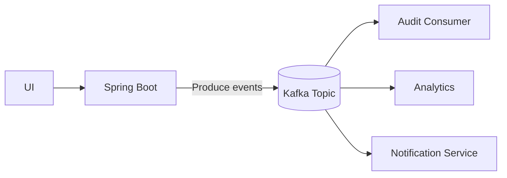
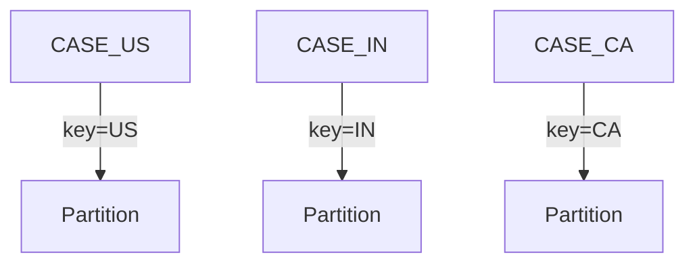
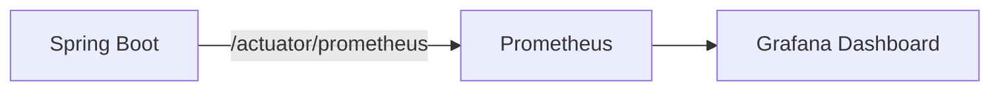
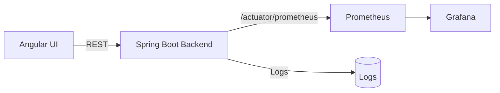
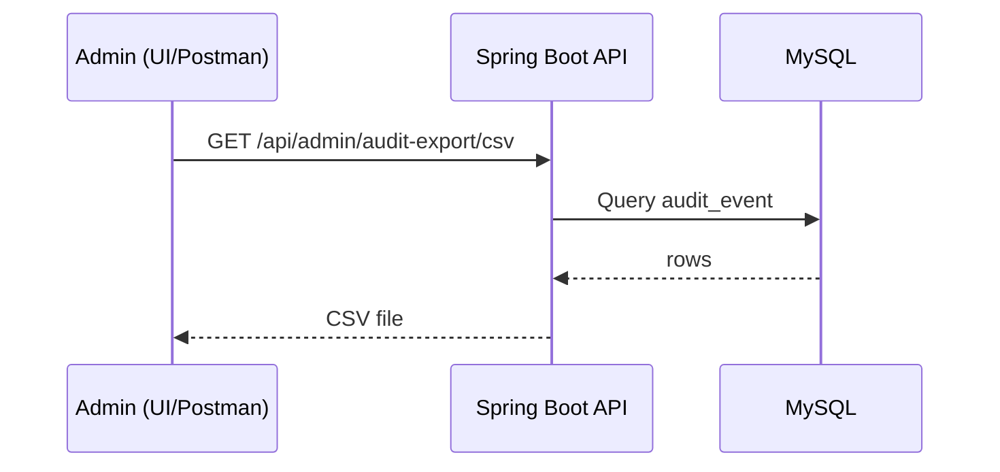

# KYC Onboarding (Appian-to-SpringBoot/Angular) – No BPM Engine

This project implements the Appian onboarding workflow as **plain Spring Boot services** and an **Angular UI** (no Camunda/Appian/BPMN).

## Workflow from the requirement doc
- Step 1: Create a **New Onboarding Case** and enter **Account Details**
- Step 2: Upload **Onboarding Case Documents** (drag/drop; add row for multiple docs)
- Docs are secured via application roles/permissions.

## Appian parity features implemented
- **SLA / Due Date timers (Appian timers equivalent)** per step (Step1/Step2/Review)
- **Audit history** timeline (status changes, uploads/deletes, SLA breaches)
- **Admin dashboard & reports** (`/admin` in UI, `/api/admin/stats` in API)

## Tech
- Backend: Spring Boot, MySQL, JPA/Hibernate
- File storage: Local filesystem
- Security: 
  - **Flow A:** Username/Password -> JWT
  - **Flow B:** OAuth2 Login -> JWT (issued on success)

---

## Folder structure
- `backend/` Spring Boot API
- `frontend/` Angular UI

---

## Quick start (Backend)
1) Create MySQL DB:
```sql
CREATE DATABASE kyc_onboarding;
```

2) Configure `backend/src/main/resources/application.yml` if needed.

3) Run:
```bash
cd backend
mvn spring-boot:run
```

Backend runs on `http://localhost:8080`

---

## Quick start (Frontend)
```bash
cd frontend
npm install
npm start
```
Frontend runs on `http://localhost:4200`

---

## Login flows

### Flow A (JWT)
- POST `/api/auth/register` (optional for demo)
- POST `/api/auth/login` -> returns `{ accessToken }`
- Use `Authorization: Bearer <token>` for API calls.

### Flow B (OAuth2)
- Start OAuth2 login: `GET /oauth2/authorization/google`
- On success backend redirects to:
`http://localhost:4200/oauth2/redirect?token=<jwt>`

> For OAuth2, add your Google client id/secret in `application.yml`.

---

## Core APIs
- Onboarding case
  - POST `/api/cases` (create case)
  - PUT `/api/cases/{caseId}/step1` (save account details)
  - PUT `/api/cases/{caseId}/submit` (validate required documents and submit)
  - PUT `/api/cases/{caseId}/review/start` (approver/admin)
  - PUT `/api/cases/{caseId}/approve` (approver/admin)
  - PUT `/api/cases/{caseId}/reject` (approver/admin)
  - GET `/api/cases?scope=mine|all` (case list)
  - GET `/api/cases/{caseId}/audit` (audit timeline)
  - GET `/api/cases/{caseId}`
- Documents
  - POST `/api/cases/{caseId}/documents` (multipart upload)
  - GET `/api/cases/{caseId}/documents`
  - GET `/api/documents/{docId}/download`
  - DELETE `/api/documents/{docId}`

---

## Notes
- Files are stored under: `backend/storage/uploads/<caseId>/` (stored path is kept relative in DB)
- Authorization:
  - `ROLE_REQUESTER`: create case, upload own docs
  - `ROLE_APPROVER`: view all, download all, start review/approve/reject
  - `ROLE_ADMIN`: admin dashboard/reports


## Swagger / OpenAPI

- UI: `http://localhost:8080/swagger-ui.html`
- Spec: `http://localhost:8080/v3/api-docs`


## Docs
- `docs/ER_Diagram.md`
- `docs/Traceability_Matrix.md`
- `docs/Docker_Cloud.md`


## API Rate Limiting
- Bucket4j based
- 100 requests/minute per IP
- Filter: `RateLimitFilter`

## RBAC – KYC Docs
See `docs/RBAC_KYC_Docs.md`


## Advanced Security
See `docs/Security_Advanced.md`


## Signed URL Fallback (Cloud vs Local)
- UI always calls `/api/documents/{id}/download-link`
- Backend decides:
  - Local FS → stream via API
  - S3/Azure → short-lived signed URL
- RBAC + ABAC enforced before issuing link

See `docs/SignedUrl_Fallback.md`


## Kafka Event Streaming

### High-Level Flow


### Partition Strategy


Docs:
- `docs/Kafka_Stream_Design.md`
- Sample payloads in `docs/kafka-samples/`


## Kafka – Advanced Capabilities
- Schema Registry (Avro/JSON)
- Exactly-once processing
- Kafka Streams (risk scoring)
- Dead-letter topics
- Event replay for audits

Docs:
- `docs/Kafka_Advanced_Use_Cases.md`
- `docs/kafka-schemas/`
PDF:
- `KYC_Kafka_Local_Setup_Guide.pdf`


## Observability (Prometheus + Grafana)



- Prometheus: http://localhost:9090
- Grafana: http://localhost:3000 (admin/admin)
Dashboard: `docs/monitoring/grafana-dashboard-kyc.json`

## Regulatory Audit Export (ADMIN)

- CSV: `/api/admin/audit-export/csv`
- Parquet: `/api/admin/audit-export/parquet`

## Code Quality
See `docs/Quality_Guide.md`
# Updated Diagrams

## Observability Flow



## Audit Export Sequence



## Code Quality References
- Backend coverage: `backend/target/site/jacoco/index.html`
- Frontend coverage: `frontend/coverage/`
- Sonar config: `sonar-project.properties`
- Guide: `docs/Quality_Guide.md`

## Grafana Provisioning (Auto setup)
Grafana is provisioned on startup:
- Prometheus datasource auto-added
- Dashboard auto-imported into folder **KYC**

Files:
- `docs/monitoring/grafana-provisioning/provisioning/datasources/prometheus.yml`
- `docs/monitoring/grafana-provisioning/provisioning/dashboards/dashboards.yml`
- `docs/monitoring/grafana-provisioning/dashboards/kyc-backend-metrics.json`

## Run Everything (Short)
1. `docker compose up -d`
2. Backend: `cd backend && mvn spring-boot:run`
3. Frontend: `cd frontend && npm install && npm start`
4. Grafana: `http://localhost:3000` (admin/admin)
5. Prometheus: `http://localhost:9090`

Full beginner guide: `docs/Execution_Guide.md`
