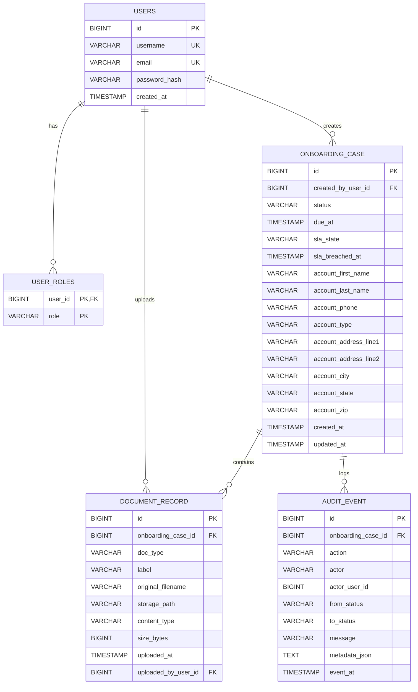

# ER Diagram (Mermaid)

> Render this in GitHub / Markdown viewers that support Mermaid.

```mermaid
erDiagram
  USERS ||--o{ USER_ROLES : has
  USERS ||--o{ ONBOARDING_CASE : creates
  ONBOARDING_CASE ||--o{ DOCUMENT_RECORD : contains
  ONBOARDING_CASE ||--o{ AUDIT_EVENT : logs
  USERS ||--o{ DOCUMENT_RECORD : uploads

  USERS {
    BIGINT id PK
    VARCHAR username UK
    VARCHAR email UK
    VARCHAR password_hash
    TIMESTAMP created_at
  }

  USER_ROLES {
    BIGINT user_id PK,FK
    VARCHAR role PK
  }

  ONBOARDING_CASE {
    BIGINT id PK
    BIGINT created_by_user_id FK
    VARCHAR status
    TIMESTAMP due_at
    VARCHAR sla_state
    TIMESTAMP sla_breached_at
    VARCHAR account_first_name
    VARCHAR account_last_name
    VARCHAR account_phone
    VARCHAR account_type
    VARCHAR account_address_line1
    VARCHAR account_address_line2
    VARCHAR account_city
    VARCHAR account_state
    VARCHAR account_zip
    TIMESTAMP created_at
    TIMESTAMP updated_at
  }

  DOCUMENT_RECORD {
    BIGINT id PK
    BIGINT onboarding_case_id FK
    VARCHAR doc_type
    VARCHAR label
    VARCHAR original_filename
    VARCHAR storage_path
    VARCHAR content_type
    BIGINT size_bytes
    TIMESTAMP uploaded_at
    BIGINT uploaded_by_user_id FK
  }

  AUDIT_EVENT {
    BIGINT id PK
    BIGINT onboarding_case_id FK
    VARCHAR action
    VARCHAR actor
    BIGINT actor_user_id
    VARCHAR from_status
    VARCHAR to_status
    VARCHAR message
    TEXT metadata_json
    TIMESTAMP event_at
  }
```
